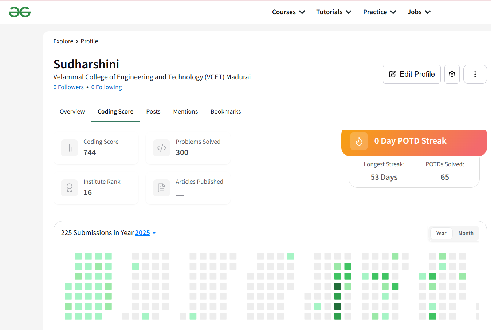

## Hi there 👋 It's me Sudharshini

Software Engineer @ Cognizant Technology Solutions

- 🔭 Here's my [portfolio](https://hareesh.web.app/)                                                 
- 🌱 I’m currently learning DSA and Generative AI to my workflow
- Engineeing at ,
 - Currently working with  **Cognizant**
 - Social Presence
  

### I code in
   

### IDE and Tools I Use

### Geeks for Geeks Profile

